# GreenTalk — Database Reference

> **Tested Version:** PostgreSQL 17.x (install the latest 17.x patch — see [Version Pinning](#version-pinning))
> **Python Driver:** psycopg2-binary 2.9.10
> **Django ORM:** All data access goes through Django ORM or explicitly parameterized queries — no raw string-formatted SQL.

---

## Table of Contents

1. [Version Pinning](#version-pinning)
2. [ER Diagram](#er-diagram)
3. [Schema Overview](#schema-overview)
4. [Design Decisions](#design-decisions)
5. [Environment Variable Reference](#environment-variable-reference)
6. [Local Setup — Windows](#local-setup--windows)
7. [Local Setup — macOS](#local-setup--macos)
8. [Local Setup — Linux (Ubuntu/Debian)](#local-setup--linux-ubuntudebian)
9. [Production Setup — Ubuntu 24.04 LTS (PGDG)](#production-setup--ubuntu-2404-lts-pgdg)
10. [Running the Schema & Seed Data](#running-the-schema--seed-data)
11. [Django Migrations Strategy](#django-migrations-strategy)
12. [Full-Text Search](#full-text-search)
13. [Trending Posts — Materialized View](#trending-posts--materialized-view)
14. [Connection Pooling — PgBouncer](#connection-pooling--pgbouncer)
15. [Backup & Restore](#backup--restore)
16. [Production Configuration](#production-configuration)
17. [Rollback & Reset Script](#rollback--reset-script)
18. [Security Notes](#security-notes)

---

## Version Pinning

| Component        | Baseline | Tested Patch | Notes |
|-----------------|----------|-------------|-------|
| PostgreSQL       | 17.x     | Install latest 17.x patch from postgresql.org at setup time and record the exact version here after `psql --version` | Do NOT upgrade to 18.x without re-running test_schema.sql |
| psycopg2-binary  | 2.9.10   | 2.9.10      | Pin exactly in requirements.txt |
| Python           | 3.12.x   | 3.12.x      | Django 5.x requires Python 3.10+ |
| Django           | 5.1.x    | 5.1.x       | LTS-aligned |

**After installation**, record the exact PostgreSQL patch by running:

```bash
psql --version
# e.g. psql (PostgreSQL) 17.2
```

Update the "Tested Patch" cell above with that output before committing.

---

## ER Diagram

```mermaid
erDiagram
    users {
        bigserial id PK
        varchar password
        varchar username UK
        varchar email UK
        user_role_enum role
        boolean is_verified
        boolean is_active
        boolean is_superuser
        boolean is_staff
        varchar phone
        text bio
        varchar avatar_url
        timestamptz created_at
        timestamptz updated_at
        timestamptz last_login
        timestamptz date_joined
    }

    user_profiles {
        bigserial id PK
        bigint user_id FK
        varchar city
        varchar state
        varchar country
        varchar postal_code
        garden_type_enum garden_type
        jsonb preferences
        varchar website_url
        timestamptz created_at
        timestamptz updated_at
    }

    categories {
        bigserial id PK
        varchar name
        varchar slug UK
        text description
        bigint parent_id FK
        smallint sort_order
        boolean is_active
        timestamptz created_at
        timestamptz updated_at
    }

    tags {
        bigserial id PK
        varchar name UK
        varchar slug UK
        timestamptz created_at
    }

    posts {
        bigserial id PK
        varchar title
        varchar slug UK
        text content
        varchar excerpt
        bigint author_id FK
        bigint category_id FK
        post_status_enum status
        varchar featured_image
        integer views_count
        varchar seo_meta_title
        varchar seo_meta_description
        tsvector search_vector
        timestamptz created_at
        timestamptz updated_at
        timestamptz published_at
    }

    post_tags {
        bigint post_id FK
        bigint tag_id FK
    }

    comments {
        bigserial id PK
        bigint post_id FK
        bigint user_id FK
        bigint parent_comment_id FK
        text content
        comment_status_enum status
        timestamptz created_at
        timestamptz updated_at
    }

    likes {
        bigserial id PK
        bigint user_id FK
        bigint post_id FK
        bigint comment_id FK
        timestamptz created_at
    }

    plants {
        bigserial id PK
        varchar name
        varchar scientific_name
        varchar category
        varchar climate_zone
        varchar soil_type
        varchar water_needs
        varchar sunlight_needs
        varchar growth_rate
        varchar native_status
        varchar image_url
        text description
        timestamptz created_at
        timestamptz updated_at
    }

    exchange_listings {
        bigserial id PK
        bigint user_id FK
        bigint plant_id FK
        varchar plant_name
        smallint quantity
        varchar condition
        listing_type_enum listing_type
        text swap_for_text
        varchar location
        listing_status_enum status
        jsonb images
        text description
        timestamptz created_at
        timestamptz updated_at
    }

    purchase_listings {
        bigserial id PK
        bigint seller_id FK
        bigint plant_id FK
        varchar title
        text description
        numeric price
        char currency
        integer stock_quantity
        jsonb images
        purchase_status_enum status
        timestamptz created_at
        timestamptz updated_at
    }

    orders {
        bigserial id PK
        bigint buyer_id FK
        bigint listing_id FK
        integer quantity
        numeric total_price
        order_status_enum status
        text notes
        timestamptz created_at
        timestamptz updated_at
    }

    notifications {
        bigserial id PK
        bigint user_id FK
        notification_type_enum type
        text message
        boolean is_read
        varchar related_object_type
        bigint related_object_id
        timestamptz created_at
    }

    audit_logs {
        bigserial id PK
        bigint actor_user_id FK
        varchar action
        varchar target_table
        bigint target_id
        jsonb metadata
        inet ip_address
        timestamptz created_at
    }

    email_verification_tokens {
        bigserial id PK
        bigint user_id FK
        varchar token UK
        timestamptz expires_at
        boolean used
        timestamptz created_at
    }

    password_reset_tokens {
        bigserial id PK
        bigint user_id FK
        varchar token UK
        timestamptz expires_at
        boolean used
        timestamptz created_at
    }

    users            ||--o| user_profiles           : "has one"
    users            ||--o{ posts                   : "authors"
    users            ||--o{ comments                : "writes"
    users            ||--o{ likes                   : "gives"
    users            ||--o{ exchange_listings        : "creates"
    users            ||--o{ purchase_listings        : "sells"
    users            ||--o{ orders                  : "places"
    users            ||--o{ notifications            : "receives"
    users            ||--o{ audit_logs              : "tracked in"
    users            ||--o{ email_verification_tokens : "has"
    users            ||--o{ password_reset_tokens    : "has"
    categories       ||--o{ posts                   : "contains"
    categories       ||--o{ categories              : "parent of"
    posts            ||--o{ comments                : "has"
    posts            ||--o{ likes                   : "receives"
    posts            ||--o{ post_tags               : "tagged with"
    tags             ||--o{ post_tags               : "applied to"
    comments         ||--o{ comments                : "parent of"
    comments         ||--o{ likes                   : "receives"
    plants           ||--o{ exchange_listings        : "listed in"
    plants           ||--o{ purchase_listings        : "listed in"
    purchase_listings ||--o{ orders                 : "ordered via"
```



---

## Schema Overview

| Table | Rows (seed) | Purpose |
|-------|------------|---------|
| `users` | 6 | Core auth + role management (extends Django AbstractUser) |
| `user_profiles` | 6 | Location, garden type, preferences |
| `categories` | 4 | Hierarchical blog categories (supports nesting via parent_id) |
| `tags` | 12 | Flat tags, many-to-many with posts |
| `posts` | 6 | Blog articles with full-text search vector |
| `post_tags` | 16 | Join table: posts ↔ tags |
| `comments` | 12 | Threaded comments (self-referencing parent_comment_id) |
| `likes` | 21 | Polymorphic likes on posts or comments |
| `plants` | 10 | Reference catalog of plant species |
| `exchange_listings` | 5 | Free/swap plant listings |
| `purchase_listings` | 5 | Marketplace plant listings with price |
| `orders` | 4 | Purchase orders referencing purchase_listings |
| `notifications` | 9 | In-app notifications per user |
| `audit_logs` | 7 | Append-only moderation trail for super admin |
| `email_verification_tokens` | 2 | One-time email verification links |
| `password_reset_tokens` | 0 | One-time password reset links |
| `trending_posts` | — | Materialized view (refreshed every 15 min) |

---

## Design Decisions

### Primary Keys — BIGSERIAL over UUID
BIGSERIAL (8-byte integer) was chosen over UUID (16 bytes) because:
- B-tree indexes on integer PKs are ~2x smaller and faster for JOINs
- Sequential inserts avoid index fragmentation (no random UUID writes)
- Django's default PK assumption is integer; BIGSERIAL requires zero extra config
- UUIDs are exposed externally only where needed (token fields use `gen_random_bytes`)

### Soft Delete — Users
Users are never hard-deleted. Deactivating sets `is_active = FALSE`. When a user row is eventually removed (rare admin action), all related posts and comments get `author_id = NULL` via `ON DELETE SET NULL`, preserving content integrity.

### ON DELETE Behavior — Justified Per Relationship

| Relationship | Behavior | Reason |
|-------------|----------|--------|
| `user_profiles.user_id → users` | CASCADE | Profile is meaningless without the user |
| `posts.author_id → users` | SET NULL | Preserve published content |
| `posts.category_id → categories` | SET NULL | Post survives category deletion |
| `comments.post_id → posts` | CASCADE | Comments have no meaning without the post |
| `comments.user_id → users` | SET NULL | Preserve discussion thread |
| `comments.parent_comment_id → comments` | CASCADE | Remove replies when parent is deleted |
| `likes.user_id → users` | CASCADE | Likes are user-specific, remove on user deletion |
| `likes.post_id → posts` | CASCADE | Like is meaningless without the post |
| `exchange_listings.user_id → users` | RESTRICT | Seller must be deactivated while listings exist |
| `purchase_listings.seller_id → users` | RESTRICT | Same as above |
| `orders.buyer_id → users` | RESTRICT | Preserve order history |
| `orders.listing_id → purchase_listings` | RESTRICT | Preserve order history |
| `audit_logs.actor_user_id → users` | SET NULL | Log entry preserved even if actor is deleted |
| `email_verification_tokens.user_id → users` | CASCADE | Tokens useless without user |
| `password_reset_tokens.user_id → users` | CASCADE | Tokens useless without user |

### Passwords
Django's PBKDF2-SHA256 hasher outputs strings of ~128 characters. The `password` field is `VARCHAR(256)` to accommodate any future algorithm upgrade (argon2, bcrypt). Plaintext passwords are never stored.

### SQL Injection Prevention
No dynamic SQL objects exist in this schema. All runtime queries must go through:
1. Django ORM (preferred)
2. `connection.execute()` with parameterized `%s` placeholders
3. Never `cursor.execute(f"SELECT ... {user_input}")` — this is forbidden

---

## Environment Variable Reference

| Variable | Example Value | Required | Description |
|----------|--------------|----------|-------------|
| `DB_ENGINE` | `django.db.backends.postgresql` | Yes | Django database backend |
| `DB_NAME` | `blog` | Yes | PostgreSQL database name |
| `DB_USER` | `postgres` | Yes | Database user |
| `DB_PASSWORD` | `root` | Yes | Database password |
| `DB_HOST` | `127.0.0.1` | Yes | Database host |
| `DB_PORT` | `5432` | Yes | Database port |
| `DJANGO_SECRET_KEY` | `<50+ char random string>` | Yes | Django secret key |
| `DJANGO_DEBUG` | `True` / `False` | Yes | Debug mode |
| `DJANGO_ALLOWED_HOSTS` | `localhost,127.0.0.1` | Yes | Comma-separated allowed hosts |
| `EMAIL_BACKEND` | `django.core.mail.backends.console.EmailBackend` | Yes | Email backend |
| `EMAIL_HOST` | `smtp.gmail.com` | Prod only | SMTP host |
| `EMAIL_PORT` | `587` | Prod only | SMTP port |
| `EMAIL_USE_TLS` | `True` | Prod only | Enable TLS |
| `EMAIL_HOST_USER` | `you@gmail.com` | Prod only | Gmail address |
| `EMAIL_HOST_PASSWORD` | `xxxx xxxx xxxx xxxx` | Prod only | Gmail App Password (16 chars) |
| `JWT_ACCESS_TOKEN_LIFETIME_MINUTES` | `60` | Yes | JWT access token TTL |
| `JWT_REFRESH_TOKEN_LIFETIME_DAYS` | `7` | Yes | JWT refresh token TTL |

---

## Local Setup — Windows

### 1. Install PostgreSQL 17 (Windows)

1. Go to the official installer: https://www.postgresql.org/download/windows/
2. Download the **PostgreSQL 17.x** installer from EDB (EnterpriseDB).
3. Run the installer. During setup:
   - Set a password for the `postgres` superuser (use `root` for local dev to match `.env`)
   - Port: `5432` (default)
   - Locale: default
4. After installation, open **pgAdmin** or **psql** from the Start menu.
5. Verify:
   ```powershell
   psql -U postgres -c "SELECT version();"
   ```

### 2. Create the database

```powershell
psql -U postgres -c "CREATE DATABASE blog;"
```

> The database already exists if you created it via pgAdmin. Skip if so.

### 3. Install psycopg2-binary in your Python environment

```powershell
pip install psycopg2-binary==2.9.10
```

---

## Local Setup — macOS

### 1. Install PostgreSQL 17 (macOS)

Option A — **Postgres.app** (recommended for Mac, zero-config):
1. Download from https://postgresapp.com/
2. Move to Applications, open it, click "Initialize"
3. Select PostgreSQL 17 server from the sidebar
4. Add to PATH (follow on-screen instructions)

Option B — **Homebrew**:
```bash
brew install postgresql@17
brew services start postgresql@17
echo 'export PATH="/opt/homebrew/opt/postgresql@17/bin:$PATH"' >> ~/.zshrc
source ~/.zshrc
```

### 2. Create the database

```bash
psql postgres -c "CREATE DATABASE blog;"
```

### 3. Install psycopg2-binary

```bash
pip install psycopg2-binary==2.9.10
```

---

## Local Setup — Linux (Ubuntu/Debian)

### 1. Install PostgreSQL 17 via PGDG (same method as production)

```bash
# Install prerequisites
sudo apt install -y curl ca-certificates

# Add PGDG repository signing key
sudo install -d /usr/share/postgresql-common/pgdg
sudo curl -o /usr/share/postgresql-common/pgdg/apt.postgresql.org.asc \
     --fail https://www.postgresql.org/media/keys/ACCC4CF8.asc

# Add the PGDG APT repository
sudo sh -c 'echo "deb [signed-by=/usr/share/postgresql-common/pgdg/apt.postgresql.org.asc] \
https://apt.postgresql.org/pub/repos/apt $(lsb_release -cs)-pgdg main" \
> /etc/apt/sources.list.d/pgdg.list'

# Install PostgreSQL 17 (exact major version, not whatever Ubuntu bundles)
sudo apt update
sudo apt install -y postgresql-17

# Start and enable the service
sudo systemctl enable postgresql
sudo systemctl start postgresql
```

### 2. Create the database and set password

```bash
sudo -u postgres psql -c "ALTER USER postgres PASSWORD 'root';"
sudo -u postgres psql -c "CREATE DATABASE blog;"
```

### 3. Install psycopg2-binary

```bash
pip install psycopg2-binary==2.9.10
```

---

## Production Setup — Ubuntu 24.04 LTS (PGDG)

> **Why PGDG and not `apt install postgresql`?**
> Ubuntu's default APT repo bundles a version that varies by release (e.g., Ubuntu 24.04 ships PostgreSQL 16). Using PGDG guarantees you get the exact same major version (17) on every server, regardless of Ubuntu release — matching your development setup.

### 1. Add PGDG Repository and Install PostgreSQL 17

```bash
# Run as root or with sudo on the Ubuntu 24.04 server

sudo apt install -y curl ca-certificates

sudo install -d /usr/share/postgresql-common/pgdg
sudo curl -o /usr/share/postgresql-common/pgdg/apt.postgresql.org.asc \
     --fail https://www.postgresql.org/media/keys/ACCC4CF8.asc

sudo sh -c 'echo "deb [signed-by=/usr/share/postgresql-common/pgdg/apt.postgresql.org.asc] \
https://apt.postgresql.org/pub/repos/apt $(lsb_release -cs)-pgdg main" \
> /etc/apt/sources.list.d/pgdg.list'

sudo apt update
sudo apt install -y postgresql-17

# Confirm version
psql --version
# psql (PostgreSQL) 17.x  ← record this exact patch in the Version Pinning table above
```

### 2. Secure the postgres superuser

```bash
sudo -u postgres psql -c "ALTER USER postgres PASSWORD 'your_strong_prod_password';"
```

### 3. Create the database

```bash
sudo -u postgres createdb blog
```

### 4. Configure SSL (production requirement)

```bash
# PostgreSQL 17 on Ubuntu generates self-signed certs at install.
# For production use a proper cert (Let's Encrypt or your CA).

# Edit postgresql.conf
sudo nano /etc/postgresql/17/main/postgresql.conf
# Set:
#   ssl = on
#   ssl_cert_file = '/etc/ssl/certs/ssl-cert-snakeoil.pem'   # replace with real cert
#   ssl_key_file  = '/etc/ssl/private/ssl-cert-snakeoil.key' # replace with real key

# Edit pg_hba.conf — require SSL for remote connections
sudo nano /etc/postgresql/17/main/pg_hba.conf
# Change remote connections from 'md5' to 'scram-sha-256' and enforce hostssl:
#   hostssl  all  all  0.0.0.0/0  scram-sha-256

sudo systemctl restart postgresql
```

### 5. Tune max_connections and shared_buffers

```bash
sudo nano /etc/postgresql/17/main/postgresql.conf
```

```ini
# For a 2GB RAM production server (adjust proportionally)
max_connections            = 100
shared_buffers             = 512MB       # 25% of total RAM
effective_cache_size       = 1536MB      # 75% of total RAM
work_mem                   = 8MB
maintenance_work_mem       = 128MB
checkpoint_completion_target = 0.9
random_page_cost           = 1.1         # SSD
wal_level                  = replica
archive_mode               = on
archive_command            = 'cp %p /var/lib/postgresql/wal_archive/%f'
```

```bash
sudo systemctl restart postgresql
```

### 6. WAL Archive Directory

```bash
sudo mkdir -p /var/lib/postgresql/wal_archive
sudo chown postgres:postgres /var/lib/postgresql/wal_archive
sudo chmod 700 /var/lib/postgresql/wal_archive
```

---

## Running the Schema & Seed Data

Run from the `db/` directory in the correct order:

```bash
# 1. Apply schema (creates all tables, indexes, triggers, materialized view)
psql -U postgres -d blog -f schema.sql

# 2. Seed sample data (users, posts, listings, etc.)
psql -U postgres -d blog -f seed_data.sql

# 3. Run tests (verify constraints, cascades, full-text search)
psql -U postgres -d blog -f test_schema.sql
```

On Windows (PowerShell):
```powershell
psql -U postgres -d blog -f db\schema.sql
psql -U postgres -d blog -f db\seed_data.sql
psql -U postgres -d blog -f db\test_schema.sql
```

---

## Django Migrations Strategy

This schema is **not applied via raw SQL migrations** in the Django project. Instead:

1. Each table above maps 1:1 to a Django model class in the `models.py` of the relevant app.
2. Run `python manage.py makemigrations` to generate migration files from models.
3. Run `python manage.py migrate` to apply them — Django generates the equivalent DDL internally.
4. The `schema.sql` file in this repo serves as the authoritative design reference, not the migration source.

### Table → Django App Mapping

| Table(s) | Django App |
|---------|-----------|
| `users`, `user_profiles`, `email_verification_tokens`, `password_reset_tokens` | `users` |
| `categories`, `tags`, `posts`, `post_tags` | `blog` |
| `comments`, `likes` | `interactions` |
| `plants`, `exchange_listings` | `exchange` |
| `purchase_listings`, `orders` | `marketplace` |
| `notifications` | `notifications` |
| `audit_logs` | `audit` |

### Key Django model notes

- `users` → subclass `AbstractUser`, add custom fields, set `AUTH_USER_MODEL = 'users.User'`
- `post_tags` → declared as `ManyToManyField(Tag, through='PostTag')` on the Post model
- `comments.parent_comment_id` → `ForeignKey('self', null=True, blank=True)`
- `categories.parent_id` → `ForeignKey('self', null=True, blank=True)`
- `audit_logs` → override the model's `save()` to prevent updates; use `managed = True`
- `trending_posts` materialized view → use `managed = False` model for read-only ORM access
- ENUM fields → use `CharField` with `choices=` in Django; PostgreSQL ENUMs are handled by custom migrations

---

## Full-Text Search

Posts use a `tsvector` column (`search_vector`) automatically maintained by a PostgreSQL trigger:

- **Weight A** — `title` (highest relevance)
- **Weight B** — `excerpt`
- **Weight C** — `content`

A GIN index on `search_vector` makes queries fast even on large tables.

### Example query

```sql
-- Find published posts matching "balcony gardening"
SELECT id, title, ts_rank(search_vector, query) AS rank
FROM posts, plainto_tsquery('english', 'balcony gardening') query
WHERE search_vector @@ query
  AND status = 'published'
ORDER BY rank DESC
LIMIT 20;
```

### Django ORM equivalent

```python
from django.contrib.postgres.search import SearchQuery, SearchRank, SearchVector

query = SearchQuery('balcony gardening')
posts = Post.objects.filter(
    search_vector=query,
    status='published'
).annotate(rank=SearchRank('search_vector', query)).order_by('-rank')
```

---

## Trending Posts — Materialized View

The `trending_posts` materialized view aggregates posts published in the last 7 days, ranked by a weighted score:

```
trend_score = (likes_in_last_7_days × 3) + views_count
```

### Refresh Strategy

Option A — **pg_cron** (install on PostgreSQL server):
```sql
-- Install pg_cron extension
CREATE EXTENSION pg_cron;

-- Schedule refresh every 15 minutes
SELECT cron.schedule('refresh-trending', '*/15 * * * *',
    'REFRESH MATERIALIZED VIEW CONCURRENTLY trending_posts');
```

Option B — **Celery Beat** (recommended, keeps scheduling in Django):
```python
# In celery_config.py
CELERY_BEAT_SCHEDULE = {
    'refresh-trending-posts': {
        'task': 'blog.tasks.refresh_trending_posts',
        'schedule': 900,  # 15 minutes in seconds
    },
}

# In blog/tasks.py
from celery import shared_task
from django.db import connection

@shared_task
def refresh_trending_posts():
    with connection.cursor() as cursor:
        cursor.execute('REFRESH MATERIALIZED VIEW CONCURRENTLY trending_posts')
```

> `CONCURRENTLY` allows reads during refresh (requires the unique index on `id`, which is defined in `schema.sql`).

---

## Connection Pooling — PgBouncer

For production, place PgBouncer between Django and PostgreSQL to manage connection limits.

### Install PgBouncer (Ubuntu 24.04)

```bash
sudo apt install -y pgbouncer
```

### Configure `/etc/pgbouncer/pgbouncer.ini`

```ini
[databases]
blog = host=127.0.0.1 port=5432 dbname=blog

[pgbouncer]
listen_addr     = 127.0.0.1
listen_port     = 6432
auth_type       = scram-sha-256
auth_file       = /etc/pgbouncer/userlist.txt
pool_mode       = transaction      ; best for Django
max_client_conn = 200
default_pool_size = 20
server_reset_query = DISCARD ALL
log_connections = 1
log_disconnections = 1
```

### `/etc/pgbouncer/userlist.txt`

```
"postgres" "your_scram_sha256_password_hash"
```

Generate hash:
```bash
psql -U postgres -c "SELECT passwd FROM pg_shadow WHERE usename = 'postgres';"
```

### Update Django `DB_PORT` to point to PgBouncer

```env
DB_HOST=127.0.0.1
DB_PORT=6432   # PgBouncer port, not 5432 directly
```

> In `transaction` pool mode, do NOT use `LISTEN/NOTIFY` or `SET` statements outside transactions. Django's ORM is fully compatible with this mode.

---

## Backup & Restore

### Backup Script — `db/backup.sh`

```bash
#!/usr/bin/env bash
# ============================================================
# GreenTalk PostgreSQL Backup Script
# Usage: bash backup.sh
# Schedule via cron: 0 2 * * * /path/to/backup.sh
# ============================================================
set -euo pipefail

DB_NAME="blog"
DB_USER="postgres"
BACKUP_DIR="/var/backups/greentalk"
TIMESTAMP=$(date +"%Y%m%d_%H%M%S")
BACKUP_FILE="${BACKUP_DIR}/greentalk_${TIMESTAMP}.dump"
KEEP_DAYS=7

# Create backup directory if it doesn't exist
mkdir -p "${BACKUP_DIR}"

# Run backup (custom format — compressed, supports parallel restore)
pg_dump \
    --username="${DB_USER}" \
    --format=custom \
    --compress=9 \
    --file="${BACKUP_FILE}" \
    "${DB_NAME}"

echo "[$(date)] Backup created: ${BACKUP_FILE}"

# Remove backups older than KEEP_DAYS days
find "${BACKUP_DIR}" -name "*.dump" -mtime +"${KEEP_DAYS}" -delete
echo "[$(date)] Old backups cleaned (keeping last ${KEEP_DAYS} days)"
```

Make it executable and schedule:
```bash
chmod +x db/backup.sh

# Add to crontab (runs at 2am daily)
crontab -e
# Add line:
# 0 2 * * * /path/to/greentalk/db/backup.sh >> /var/log/greentalk_backup.log 2>&1
```

### Restore Script

```bash
# Full restore (overwrites existing data)
pg_restore \
    --username=postgres \
    --dbname=blog \
    --clean \
    --if-exists \
    --no-owner \
    /var/backups/greentalk/greentalk_20260926_020000.dump

# Restore to a new database for verification before cutting over
createdb -U postgres blog_restore
pg_restore \
    --username=postgres \
    --dbname=blog_restore \
    --no-owner \
    /var/backups/greentalk/greentalk_20260926_020000.dump
```

### Quick schema-only export (useful for migrations review)

```bash
pg_dump -U postgres --schema-only blog > db/schema_export.sql
```

---

## Production Configuration

Summary of key `postgresql.conf` settings for an Ubuntu 24.04 production server:

```ini
# --- Connections ---
max_connections            = 100          # Use PgBouncer; keep this low
superuser_reserved_connections = 3

# --- Memory (adjust for available RAM) ---
shared_buffers             = 512MB        # 25% of RAM
effective_cache_size       = 1536MB       # 75% of RAM
work_mem                   = 8MB          # per sort/hash operation
maintenance_work_mem       = 128MB        # for VACUUM, CREATE INDEX

# --- Write Performance ---
checkpoint_completion_target = 0.9
wal_buffers                = 16MB

# --- Disk (SSD assumed) ---
random_page_cost           = 1.1
effective_io_concurrency   = 200

# --- Logging ---
log_min_duration_statement = 1000        # log queries > 1 second
log_checkpoints            = on
log_connections            = on
log_disconnections         = on

# --- SSL ---
ssl                        = on
ssl_cert_file              = 'server.crt'
ssl_key_file               = 'server.key'

# --- WAL Archiving ---
wal_level                  = replica
archive_mode               = on
archive_command            = 'cp %p /var/lib/postgresql/wal_archive/%f'
```

Apply changes:
```bash
sudo systemctl reload postgresql
# For settings that require restart:
sudo systemctl restart postgresql
```

---

## Rollback & Reset Script

> **WARNING:** This destroys ALL data. Only use in local development.

```sql
-- db/reset.sql
-- Usage: psql -U postgres -d blog -f db/reset.sql
-- ============================================================
-- DROP ORDER matters — foreign keys must be dropped first.
-- ============================================================

DROP MATERIALIZED VIEW IF EXISTS trending_posts CASCADE;

DROP TABLE IF EXISTS
    password_reset_tokens,
    email_verification_tokens,
    audit_logs,
    notifications,
    orders,
    purchase_listings,
    exchange_listings,
    plants,
    likes,
    comments,
    post_tags,
    posts,
    tags,
    categories,
    user_profiles,
    users
CASCADE;

DROP TYPE IF EXISTS
    user_role_enum,
    garden_type_enum,
    post_status_enum,
    comment_status_enum,
    listing_type_enum,
    listing_status_enum,
    purchase_status_enum,
    order_status_enum,
    notification_type_enum
CASCADE;

DROP FUNCTION IF EXISTS posts_search_vector_update() CASCADE;
DROP FUNCTION IF EXISTS posts_set_published_at()     CASCADE;
DROP FUNCTION IF EXISTS set_updated_at()             CASCADE;

\echo 'Database reset complete. Run schema.sql and seed_data.sql to reinitialize.'
```

To do a full reset and re-initialize:

```bash
# Windows PowerShell
psql -U postgres -d blog -f db\reset.sql
psql -U postgres -d blog -f db\schema.sql
psql -U postgres -d blog -f db\seed_data.sql

# Linux/macOS
psql -U postgres -d blog -f db/reset.sql
psql -U postgres -d blog -f db/schema.sql
psql -U postgres -d blog -f db/seed_data.sql
```

---

## Security Notes

1. **Never commit `.env`** — add it to `.gitignore`. Only `.env.example` is committed.
2. **Password hashing** — Django handles all password hashing (PBKDF2-SHA256 by default). The `password` column only ever holds the hash string, never plaintext.
3. **SQL injection** — all queries go through Django ORM or psycopg2 parameterized queries. String-formatted SQL is forbidden.
4. **Audit log is append-only** — the `audit_logs` table has no `updated_at` and should never be updated or deleted. Enforce this in the Django model's `save()` and `delete()` methods.
5. **Token security** — `email_verification_tokens` and `password_reset_tokens` use `gen_random_bytes(32)` encoded as hex (64-char string = 256 bits entropy). Tokens are one-time use (`used = TRUE` after consumption) and expire automatically.
6. **HTTPS only in production** — enforce `SECURE_SSL_REDIRECT = True` and `SECURE_HSTS_SECONDS` in Django production settings alongside PostgreSQL SSL enforcement.
7. **Rate limiting** — implement Django rate-limit middleware on auth endpoints (login, password reset, email verification) to prevent brute-force attacks.

---

## Remediation Log (Prompt 4 — What Was Found and Fixed)

### Migration State Diagnosis

**Date diagnosed:** September 2026
**Scenario classified as: (b) — Models existed, zero migrations generated.**

#### What was found

All five local app migration folders contained only `__init__.py` — no `0001_initial.py` had ever been generated for `accounts`, `blog`, `marketplace`, `notifications`, or `audit`. The PostgreSQL tables in the `blog` database had been created by running `db/schema.sql` directly (raw SQL from the initial DB design phase). Django's migration system had no record of any of these tables.

Running `python manage.py check` revealed two additional blocking errors:

| Error | Root Cause | Fix Applied |
|-------|-----------|-------------|
| `ModuleNotFoundError: No module named 'imghdr'` | `imghdr` was removed in Python 3.13 (system has Python 3.13.5) | Replaced with Pillow-based image format detection in `apps/core/file_upload.py` |
| `postgres.E005 SearchVectorField requires django.contrib.postgres` | `django.contrib.postgres` was missing from `INSTALLED_APPS` | Added to `DJANGO_APPS` list in `settings/base.py` |

Two further settings issues were also corrected:

| Issue | Fix |
|-------|-----|
| `STATICFILES_STORAGE` deprecated in Django 4.2 (project has Django 6.0.6 installed) | Replaced with `STORAGES` dict format in `settings/base.py` and `settings/production.py` |
| `local.py` used `REST_FRAMEWORK = {**globals()...}` pattern which silently resets the full dict | Fixed to mutate `REST_FRAMEWORK["DEFAULT_THROTTLE_RATES"]` directly |

#### What was done (minimum safe changes)

1. **Created `backend/.env`** with the current local dev values (`DB_USER=postgres`, `DB_PASSWORD=root`, `DB_NAME=blog`). Settings already read from `.env` via `django-environ` — no settings code change needed.
2. **Fixed `apps/core/file_upload.py`** — replaced `import imghdr` with Pillow's `PIL.Image.open()` for magic-byte detection.
3. **Added `django.contrib.postgres`** to `INSTALLED_APPS` in `settings/base.py`.
4. **Fixed `STORAGES` dict** in `settings/base.py` and `settings/production.py`.
5. **Fixed `local.py`** throttle override pattern.
6. **Ran `python manage.py makemigrations`** — generated `0001_initial.py` for all 5 apps.
7. **Ran `python manage.py migrate`** — applied all migrations cleanly; all `[X]` in `showmigrations`.
8. **Confirmed `python manage.py check`** → `System check identified no issues (0 silenced).`
9. **Confirmed `python manage.py makemigrations --check`** → exit code 0, no pending changes.

#### No data was lost

The raw tables created by `db/schema.sql` coexisted with the Django migrations — Django detected them already present and migrated cleanly without dropping or altering any existing data.

---

## Local Development — Connection Setup

After remediation, connecting locally requires only these steps:

```bash
# 1. Ensure backend/.env exists (already created — do NOT commit it)
#    Values: DB_USER=postgres, DB_PASSWORD=root, DB_NAME=blog, DB_HOST=127.0.0.1

# 2. Install Python dependencies
pip install -r requirements.txt

# 3. Confirm check passes
python manage.py check --settings=greentalk.settings.local

# 4. Apply migrations (already applied — run on fresh clone)
python manage.py migrate --settings=greentalk.settings.local

# 5. Start development server
python manage.py runserver --settings=greentalk.settings.local
```

The `DB_USER=postgres` + `DB_PASSWORD=root` credentials are intentional for **local development only**.
They are kept simple by design — a dedicated least-privilege role is provided for production.

---

## Before Deploying to Production

> ⚠️ **Do NOT run `db/create_production_role.sql` against your local dev database.**
> It is labeled clearly inside the file. Run it only once, on the production server, before first deployment.

### Step 1 — Create the production database role

```bash
# SSH into Ubuntu 24.04 LTS production server
sudo -u postgres psql -d blog -f /path/to/db/create_production_role.sql
```

The script creates role `greentalk_app` with:
- `LOGIN` (can connect), `NOSUPERUSER`, `NOCREATEDB`, `NOCREATEROLE`
- `SELECT, INSERT, UPDATE, DELETE` on all app tables
- `UPDATE, DELETE` revoked on `audit_logs` (append-only enforcement)
- Default privileges so future Django migrations also inherit these grants

### Step 2 — Update production `.env` only

```env
# Change ONLY these two lines in your production .env:
DB_USER=greentalk_app
DB_PASSWORD=<the strong password from create_production_role.sql>
# All other production settings remain as documented in backend/README.md
```

### Step 3 — Never reuse local credentials in production

The `postgres` superuser password `root` must **never** appear in a production `.env`.
The `backend/.env` file is in `.gitignore` and cannot accidentally be deployed via git.

---

## Model-to-Table Reconciliation (Post-Remediation)

All 16 entities from the original schema design are confirmed implemented as Django models:

| DB Table | Django Model | App | Migration |
|----------|-------------|-----|-----------|
| `users` | `User` (AbstractUser) | accounts | `0001_initial` ✓ |
| `user_profiles` | `UserProfile` | accounts | `0001_initial` ✓ |
| `email_verification_tokens` | `EmailVerificationToken` | accounts | `0001_initial` ✓ |
| `password_reset_tokens` | `PasswordResetToken` | accounts | `0001_initial` ✓ |
| `categories` | `Category` | blog | `0001_initial` ✓ |
| `tags` | `Tag` | blog | `0001_initial` ✓ |
| `posts` | `Post` | blog | `0001_initial` ✓ |
| `post_tags` | `PostTag` | blog | `0001_initial` ✓ |
| `comments` | `Comment` | blog | `0001_initial` ✓ |
| `likes` | `Like` | blog | `0001_initial` ✓ |
| `plants` | `Plant` | marketplace | `0001_initial` ✓ |
| `exchange_listings` | `ExchangeListing` | marketplace | `0001_initial` ✓ |
| `purchase_listings` | `PurchaseListing` | marketplace | `0001_initial` ✓ |
| `orders` | `Order` | marketplace | `0001_initial` ✓ |
| `notifications` | `Notification` | notifications | `0001_initial` ✓ |
| `audit_logs` | `AuditLog` | audit | `0001_initial` ✓ |

### Business logic alignment confirmed

| Requirement | Implementation | Location |
|-------------|---------------|----------|
| User posts → `pending` | `_determine_status()` enforces in serializer | `apps/blog/serializers.py` |
| Admin posts → `published` | `_determine_status()` configurable via `POST_AUTO_PUBLISH_FOR_ADMINS` | `apps/blog/serializers.py` |
| Client cannot override status | `status` field not in `PostWriteSerializer.fields` | `apps/blog/serializers.py` |
| No payment gateway | `Order` is intent-only; no payment fields | `apps/marketplace/models.py` |
| Role enum | `ROLE_USER / ROLE_BLOG_ADMIN / ROLE_SUPER_ADMIN` choices on `User` | `apps/accounts/models.py` |
| Audit log append-only | `save()` raises on update, `delete()` raises always | `apps/audit/models.py` |
